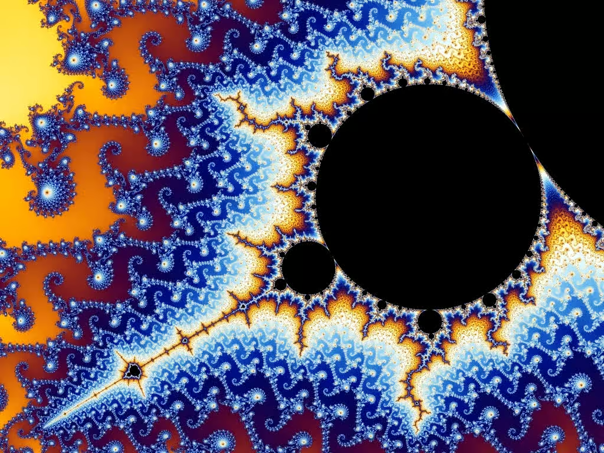

# Fractol 🌿✨

Fractol is a visually stunning program that allows users to explore and visualize fractals such as the Mandelbrot set, Julia set, Burning Ship fractal, and more. It provides an interactive and customizable experience for delving into the fascinating world of fractals.



## Requirements 🖥️

- **macOS**: This program has been tested and confirmed to work on macOS. Performance and compatibility may vary on other systems.
- **minilibx** : This project requires the minilibx library to compile and run. The library is included in the repository and should work out of the box on macOS.


## Installation 📥

Follow the steps below to install and run the Fractol program:

1. **Clone the Repository**:
   Clone the repository from GitHub to your local machine:
   ```bash
   git clone https://github.com/username/fractol.git
   ```

2. **Compile the Program**:
   Navigate into the cloned directory and compile the program using `make`:
   ```bash
   cd fractol
   make
   ```

3. **Run the Program**:
   Once compiled, run the program by specifying the fractal you wish to display:
   ```bash
   ./fractol [fractal_name]
   ```

## Fractal Options 🌐

Fractol supports several fractal types. Use the following names to specify which fractal you want to explore:

- **Mandelbrot**: 
  ```bash
  ./fractol mandelbrot
  ```
  
![Mandelbrot Image] (images/image.png)

- **Julia**: 
  ```bash
  ./fractol julia
  ```

- **Tricorn**: 
  ```bash
  ./fractol tricorn
  ```

> Note: Ensure that you use the correct spelling and case for fractal names when launching the program.

## Usage 🎮

Once the program is running, you can interact with the fractal using the following controls:

### Mouse Controls 🖱️

- **Zoom**: Use the **scroll wheel** to zoom in and out of the fractal, allowing you to examine intricate details or zoom out for a broader view.
- **Pan**: Hold down the **left mouse button** and drag to pan around the fractal image. This lets you move across different parts of the fractal without zooming.

### Keyboard Controls ⌨️

- **Change Color Palette**: Press the **`C`** key to cycle through different color schemes. This adds variety to the visualization of the fractal.

  


## Troubleshooting 🛠️

- **Compile Errors**: Ensure that you have the necessary dependencies and tools installed on your system, including a C compiler like GCC or Clang.
- **Performance Issues**: If the fractal rendering is slow, try reducing the number of iterations or switching to a less complex fractal.
  
## Project Information 📚

Fractol is part of the **42 Curriculum** and serves as a project to help students learn advanced graphical programming, complex mathematical concepts, and algorithm optimization.

## License 📜

This project is open-source and licensed under the MIT License. Contributions and forks are welcome!

=
